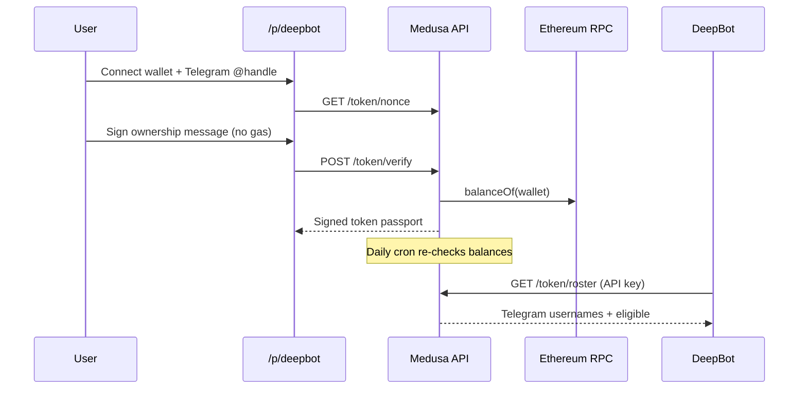

# DeepBot × Medusa — Token Passport

Medusa issues a **short-lived token passport** to Ethereum wallets that hold enough **$DEEPBOT**. DeepBot uses the passport roster to gate Telegram/community access **without** seeing wallet addresses or balances.

| | |
|---|---|
| **Holder page** | `https://www.zkmedusa.com/p/deepbot` (hidden, not in navbar) |
| **Partner id** | `deepbot` |
| **Chain** | Ethereum mainnet |
| **Token** | `0x18bC66F0C15e27179DD8E2277C1c9c056Df0a14d` |
| **Default threshold** | `100,000` $DEEPBOT (whole tokens) |
| **Passport validity** | 24 hours (re-checked automatically) |
| **Telegram** | Required at verification |

---

## How it works



1. User opens the partner page and connects an **Ethereum mainnet** wallet.
2. User enters their **Telegram username** and signs a free ownership message.
3. Medusa checks `balanceOf` on-chain and stores an **opaque holder id** (HMAC of address — not reversible).
4. If eligible, Medusa returns a **signed `MedusaTokenPassport`** (24h).
5. A **daily cron** re-checks stored holders so eligibility stays current if someone sells.
6. DeepBot pulls the **roster API** to sync Telegram allowlists.

---

## For DeepBot (integration)

### Roster export (primary integration)

Fetch eligible Telegram handles. **No wallet addresses, balances, or holder ids** are returned.

```http
GET https://www.zkmedusa.com/api/partner/deepbot/token/roster
Authorization: Bearer <your_api_key>
```

**Response:**

```json
{
  "partnerId": "deepbot",
  "count": 42,
  "entries": [
    { "telegramUsername": "alice", "eligible": true },
    { "telegramUsername": "bob", "eligible": false }
  ]
}
```

- `eligible: true` — holds enough $DEEPBOT and passport is still within the 24h window.
- `eligible: false` — below threshold, expired, or failed last refresh.

**API key:** Medusa provisions a scoped key in `MEDUSA_PARTNER_API_KEYS`:

```env
MEDUSA_PARTNER_API_KEYS=deepbot:sk_live_your_secret_here
```

Only the `deepbot` key works on `/api/partner/deepbot/...` routes.

**Suggested sync cadence:** poll every few hours, or after you announce a verification campaign. The daily Medusa cron already refreshes on-chain balances.

### Optional: gate a specific wallet live

```http
GET https://www.zkmedusa.com/api/partner/deepbot/token/status?address=0x...
```

Returns fresh `eligible`, `holderId`, `threshold`, `expiresAt`. Useful for one-off checks; roster is better for Telegram lists.

### Optional: aggregate stats (public)

```http
GET https://www.zkmedusa.com/api/partner/deepbot/token/stats
```

```json
{
  "partnerId": "deepbot",
  "total": 120,
  "eligible": 95,
  "eligibleActive": 88
}
```

No addresses exposed.

### Verifying a passport client-side

If you receive a `MedusaTokenPassport` JSON payload from a user, verify:

- `type === "medusa_token_passport_v1"`
- `partnerId === "deepbot"`
- `eligible === true`
- `expiresAt` is in the future
- Ed25519 signature matches Medusa issuer public key (`PASSPORT_ISSUER_PUBLIC_KEY`)

Passport shape:

```json
{
  "type": "medusa_token_passport_v1",
  "chain": "ethereum",
  "partnerId": "deepbot",
  "partnerName": "DeepBot",
  "token": "0x18bC66F0C15e27179DD8E2277C1c9c056Df0a14d",
  "eligible": true,
  "holderId": "<opaque_hmac>",
  "threshold": "100000",
  "issuedAt": "2026-06-22T12:00:00.000Z",
  "expiresAt": "2026-06-23T12:00:00.000Z",
  "telegramUsername": "alice",
  "issuer": "medusa",
  "signature": "<hex>"
}
```

---

## For holders

Share this link (do not rely on navbar discovery):

**https://www.zkmedusa.com/p/deepbot**

Requirements:

- Ethereum mainnet wallet with ≥ threshold $DEEPBOT
- Telegram username (linked once per wallet)
- Sign a message — **no gas**, no token transfer

If holdings drop below the threshold, the next cron refresh marks the passport ineligible and roster `eligible` becomes `false`.

---

## Medusa operator checklist

### Required env (production)

| Variable | Purpose |
|----------|---------|
| `MEDUSA_PARTNER_API_KEYS` | `deepbot:sk_live_...` for roster auth |
| `MEDUSA_PARTNER_PEPPER` | HMAC salt for opaque `holderId` |
| `MEDUSA_PARTNER_ENCRYPTION_KEY` | AES-256 key so daily cron can re-check balances |
| `PASSPORT_ISSUER_SECRET_KEY` | Signs token passports |
| `ETH_RPC_URL` | Ethereum mainnet RPC (Alchemy/Infura recommended) |
| `KV_REST_API_URL` / `KV_REST_API_TOKEN` | Redis store for holders (Vercel KV) |
| `CRON_SECRET` | Protects `/api/partner/cron/refresh` |

### Optional

| Variable | Purpose |
|----------|---------|
| `MEDUSA_TOKEN_THRESHOLD_DEEPBOT` | Override threshold without redeploy (e.g. `500` for testing) |
| `NEXT_PUBLIC_WALLETCONNECT_PROJECT_ID` | Mobile / WalletConnect wallets on partner page |

### Testing at a lower threshold

```env
MEDUSA_TOKEN_THRESHOLD_DEEPBOT=500
```

Redeploy or restart dev server. The page and API use the override immediately.

### Daily refresh cron

Configured in `vercel.json`:

```
GET /api/partner/cron/refresh  —  daily (00:00 UTC)
```

Re-queries every stored holder's balance and extends or revokes eligibility.

Manual trigger (production):

```bash
curl -H "Authorization: Bearer $CRON_SECRET" \
  https://www.zkmedusa.com/api/partner/cron/refresh
```

---

## API reference (DeepBot)

| Method | Path | Auth | Description |
|--------|------|------|-------------|
| `GET` | `/api/partner/deepbot/token/nonce` | — | Issue one-time nonce for signing |
| `POST` | `/api/partner/deepbot/token/verify` | — | Sign + balance check → passport |
| `GET` | `/api/partner/deepbot/token/status` | — | Live or cached eligibility |
| `GET` | `/api/partner/deepbot/token/roster` | Bearer API key | Telegram roster for gating |
| `GET` | `/api/partner/deepbot/token/stats` | — | Anonymous counts |

### Verify request body

```json
{
  "address": "0x...",
  "signature": "0x...",
  "nonce": "...",
  "issuedAt": "2026-06-22T12:00:00.000Z",
  "telegramUsername": "alice"
}
```

---

## Privacy

- Raw wallet addresses are **never** stored in plain text.
- DeepBot roster returns **Telegram username + boolean eligibility** only.
- `holderId` is an HMAC — not reversible without the server pepper.
- Addresses are encrypted at rest (`addressEnc`) solely for automated balance refresh.

---

## Code map

| File | Role |
|------|------|
| `src/lib/partner/partners.ts` | DeepBot config (token, threshold, branding) |
| `app/p/[slug]/page.tsx` | Holder UI at `/p/deepbot` |
| `src/components/partner/PartnerTokenFlow.tsx` | Wallet connect + verify flow |
| `app/api/partner/[id]/token/*` | Nonce, verify, status, roster, stats |
| `app/api/partner/cron/refresh/route.ts` | Daily balance re-check |

---

## Support

- Medusa site: [zkmedusa.com](https://www.zkmedusa.com)
- Telegram: [t.me/zkmedusa](https://t.me/zkmedusa)

For API key rotation or threshold changes, contact the Medusa team.
